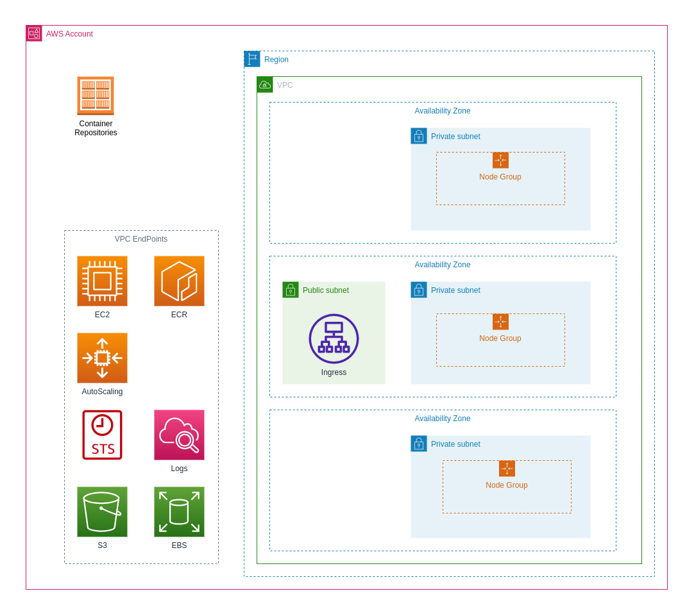
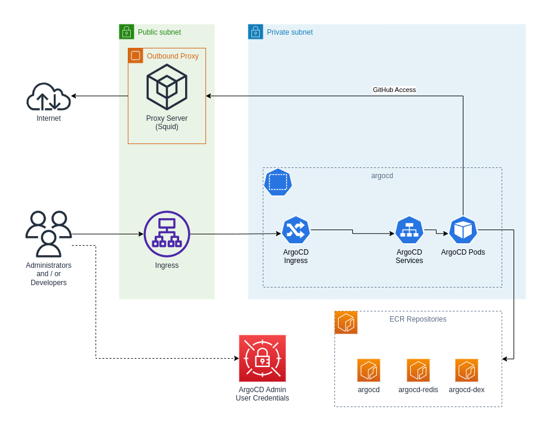

# EKS in a Private Subnet Scenario

# Conceptual Designs

## EKS Cluster Infrastructure

The diagram below provides a basic view of the key EKS components:

There are of course also several details not shown on the diagram, for example the various add-ons etc.

The VPC End-Points is required for access by resources deployed in EKS to the AWS API's. Example of deployments that would require such access include:

* AWS AutoScaler Controller
* AWS Load Balancer Controller

## EKS Deployment of ArgoCD

ArgoCD is typically used for Continuous Deployment (CD) of workloads in Kubernetes / EKS. Below is the lab setup to accomplish this:

In the Lab environment, the configuration will assume access to GitHub is required. The ArgoCD Admin Portal is reached via an Ingress exposed in AWS by an application load balancer, which in turn is provisioned by the [AWS Load Balancer Controller](https://kubernetes-sigs.github.io/aws-load-balancer-controller/).

> [!IMPORTANT]
> The lab environment requires an Internet Proxy server for ArgoCD to access GitHub. It is therefore recommended that the EC2 instance tags for the proxy server aligns with the time period you intend to run the EKS cluster. If you choose to manually control the termination of the Proxy Server, remember to remove the `IdleStopperManaged` tag. Refer to the [VPC deployment documentation](../ec2-bastion-public-subnet/README.md).

# Deployment

> [!CAUTION]
> All deployments below depend on the [VPC Deployment Goal](../vpc-private-with-limited-public-access/README.md).

## EKS Infrastructure

| Scenario                                 | Description                                                                                    | Dependencies (Scenarios)                                                   |
|:----------------------------------------:|------------------------------------------------------------------------------------------------|:--------------------------------------------------------------------------:|
| [0010](./0010-eks-security-groups.md)    | Security groups required by EKS.                                                               | [VPC Deployment Goal](../vpc-private-with-limited-public-access/README.md) |
| [0020](./0020-private-vpc-endpoints.md)  | Private VPC's require endpoints for services in the VPC to communicate with AWS Service API's. | 0030                                                                       |
| [0030](./0030-eks-cluster.md)            | Deploy the EKS cluster.                                                                        | 0050                                                                       |
| [0040](./0040-eks-node-base.md)          | Deploy the base stack that each EKS Node group will reference.                                 | 0080                                                                       |
| [0050](./0050-eks-node-groups.md)        | Deploy a Nodegroup per available subnet.                                                       | 0090                                                                       |
| [0060](./0060-ecr-argocd.md)             | Create an ECR repository for the ArgoCD Image and then deploy ArgoCD in EKS.                   | 0100                                                                       |

