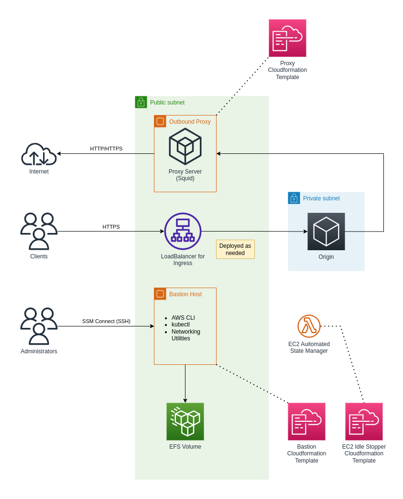

- [VPC with Public and Private Subnets](#vpc-with-public-and-private-subnets)
- [Conceptual Designs](#conceptual-designs)
  - [General Networking](#general-networking)
  - [Ingress and Egress](#ingress-and-egress)
- [Deployment](#deployment)
  - [General Networking Stacks](#general-networking-stacks)
  - [Ingress and Egress Stacks](#ingress-and-egress-stacks)

# VPC with Public and Private Subnets

This configuration is useful to test scenario where you need to have resources deployed mainly in private subnets but with access facilitated through a public subnet that would host Load Balancer end-point or a bastion host that you could still access from the Internet. 

It is useful in cases where you are testing on an account that does not have any integration with a corporate network. In corporate networks the public subnet would not be necessary as traffic would typically be routed via a transit gateway and access would be controlled via the corporate network infrastructure.

# Conceptual Designs

## General Networking

The general networking concepts are illustrated below:

The primary CloudFormation stack for this scenario will deploy the following key resources:

* The VPC
* At least 3x Private Subnets
* At least 1x Public Subnet that has Internet Access
* A S3 bucket to manage flow logs

There are several other networking or VPC related resources assumed to be either pre-existing, or that will be created by other scenarios as needed. These include:

* Route 53 Hosted Zone(s)
* ACM Certificates for the Route 53 Hosted Zone(s)
* VPC EndPoints

## Ingress and Egress

This scenario includes some additional stacks to assist with Ingress and Egress network traffic, as illustrated below:

There are at least two EC2 focused stacks:

* Proxy stack, that will deploy a Internet Proxy Server that internal resources deployed in the Private Subnets can use for Internet access. The motivation for this approach is that in a lab environment this approach is typically cheaper than a NAT Gateway, which would be a more appropriate option for production environments.
* Bastion host from where account administrators can access a terminal in the VPC. This is only required since the AWS Cloud Shell cannot yet be started in a VPC context (read [the FAQ](https://aws.amazon.com/cloudshell/faqs/) as well as [this question on AWS re:Post](https://repost.aws/questions/QU93xTKW2jRSahpb9DVfO4PQ/aws-cloud-shell-connection-on-private-ip)).

There is also a Lambda Function stack deployed that will scan for EC2 instances in certain subnets and monitor the following tags:

| Tag Name             | Values and Meaning                                                                                                                                |
|----------------------|---------------------------------------------------------------------------------------------------------------------------------------------------|
| `IdleStopperManaged` | Regardless of the value, if the tag is present, the Lambda Function will manage this instance based on configuration                              |
| `MaxUptime`          | The maximum allowed uptime in seconds, relative to the instance start time. If not present, the default of 2 hours (7200 seconds) will be assumed |

Administrators can directly edit the `MaxUptime` as required. The initial value is set as a parameter in the CloudFormation templates for the EC2 instances.

# Deployment

## General Networking Stacks

| Scenario                                                 | Description                                                                                                                | Dependencies (Scenarios) |
|:--------------------------------------------------------:|----------------------------------------------------------------------------------------------------------------------------|:------------------------:|
| [0010](./0010-basic-private-vpc-with-flowlogs-to-s3.md)  | The aim of this scenario is to deploy a basic private VPC. It may serve as a base for several other examples/scenarios.    | N/A                      |
| [0020](./0020-enable-ec2-ssm-access.md)                  | Enable policies to allow EC2 instance access via SSM.                                                                      | N/A                      |
| [0030](./0030-add-secondary-cidr-to-private-vpc.md)      | Adds a secondary CIDR to a Private VPC, which is useful for scenarios where you have a limited VPC CIDR with EKS deployed. | 0010                     |

## Ingress and Egress Stacks

Deployment of these stacks depend on what exactly you need and these are considered optional. In most cases, you may need at least the bastion host stack.

These stacks only provides the relevant EC2 Launch Templates. To actually launch the instances, you may have to run the additional commands as describes in each stack documentation.

<!-- TODO Add Ingress and Egress stacks  -->

> [!NOTE]
> This is still work in progress...

| Scenario                              | Description                                                              | Dependencies (Scenarios) |
|:-------------------------------------:|--------------------------------------------------------------------------|:------------------------:|
| [0040](./0040-ec2-internet-proxy.md)  | Deploy an Internet proxy as a cheap alternative to a NAT gateway.        | 0010                     |
| [0050](./0050-ec2-bastion-host.md)    | Deploy a Bastion host to which administrators can connect to via SSM.    | 0010                     |
| [0060](./0060-lambda-ec2-manager.md)  | Terminates EC2 instances based on tag values.                            | 0010                     |

